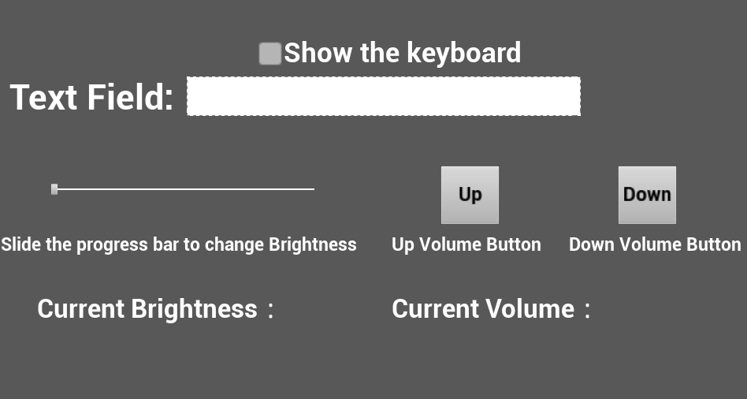
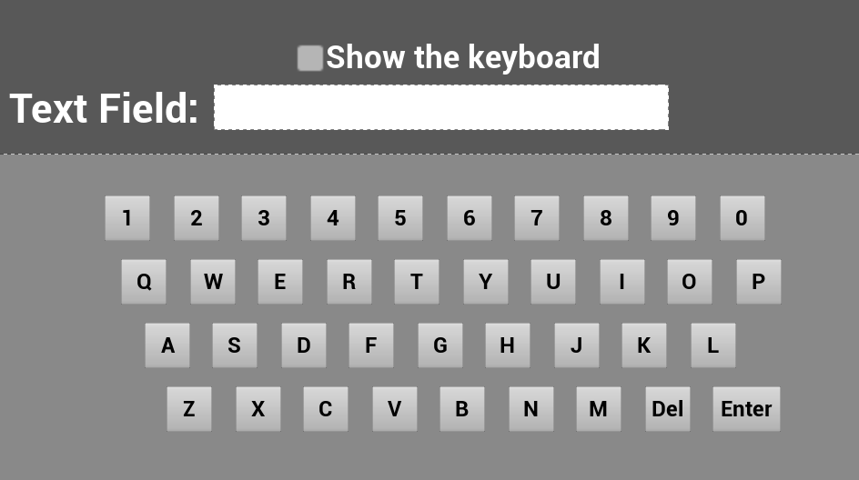

# UI Interaction

- If you have any questions/comments, please visit [**Pico Developer Answers**](https://devanswers.pico-interactive.com/) and raise your question there.

## Unreal Engine 4 & SDK Version
- Unreal Engine : 4.27.2

- Pico Unreal Integration SDK v2.1.2

## Description:
This demo includes following UI implementations:
* Button    
* Checkbox   
* Slide Bar    

Press the trigger button on the right controller for interaction, UI functions are shown in the figure below:

   

   

## Note:
- This project integrates v4.27 of Pico Unreal Integration SDK, If you are using other version of the engine, you need to download the corresponding version of Pico Unreal Integration SDK at [here.](https://developer-global.pico-interactive.com/sdk?deviceId=1&platformId=2&itemId=13)
