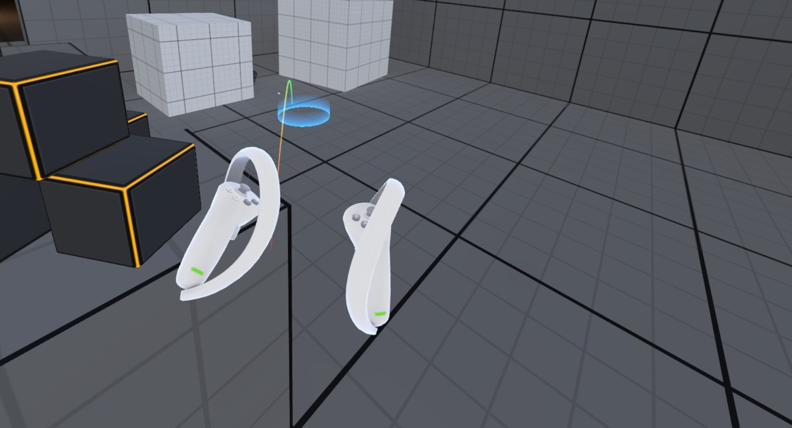
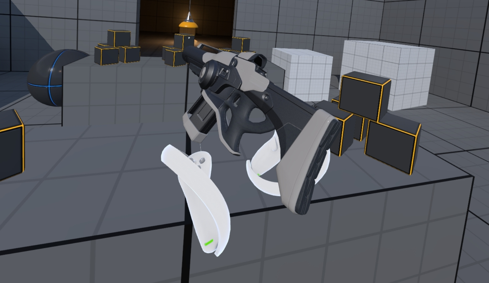
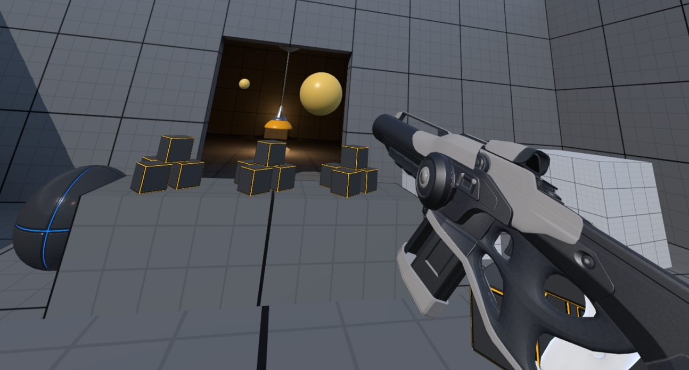
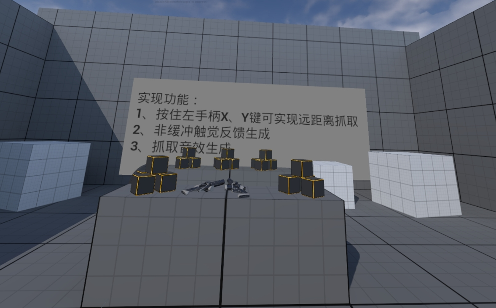
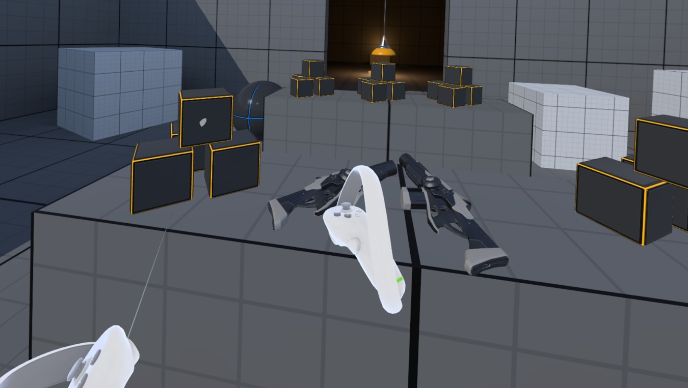
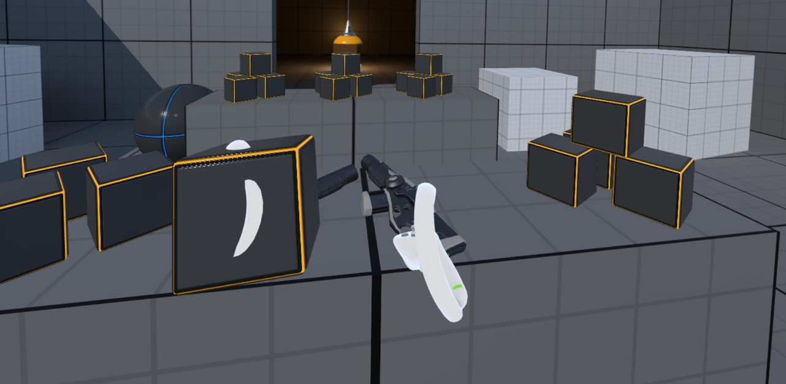

# PICO Unreal Interaction Sample 

- If you have any questions/comments, please visit [**Pico Developer Support Portal**](https://picodevsupport.freshdesk.com/support/home) and raise your question there.

## Unreal Engine 5 & SDK Version
- Unreal Engine : 5.3.2

- Pico Unreal Integration SDK v3.1.0

## Description:
  The functions realized in this example include:
* Press and hold the left handle X, Y key can realize long-distance grasping
* Vibration feedback
* Grabbing sound effect generation

The example includes a basic interaction based on VR_Pawn with the following effect:
   
   
   
In addition to this, the introductory UI interface of the Demo is provided, which can complete the long-distance capture, and realize the function as shown in Fig:

   
Ray Selection

   
Grab function implementation

   

## Note:
- This project integrates v5.3 of Pico Unreal Integration SDK, If you are using other version of the engine, you need to download the corresponding version of Pico Unreal Integration SDK at [here.](https://developer.picoxr.com/zh/resources/#sdk)
